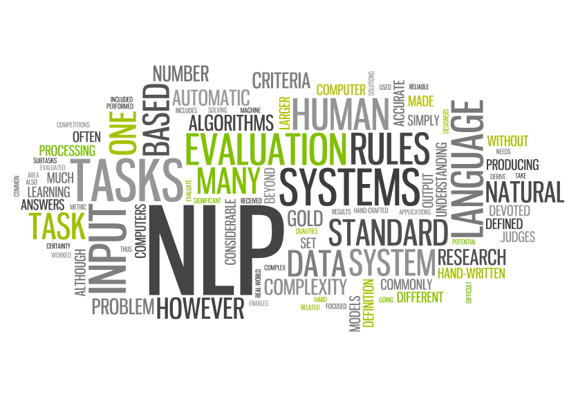

# nlp-akash
## Natural Language Processing notes and implementations 
Learning Notes: [nlp-learning](https://github.com/akashp1712/nlp-akash/blob/master/nlp-learning.md)

## Text Summarization
--------------------
### Algorithms
--------------------
#### 1. Summarization implementation using word frequency.
   Code: [**Word_Frequency_Summarization:**](https://github.com/akashp1712/nlp-akash/blob/master/text-summarization/Word_Frequency_Summarization.py)  
   Article: [**Text summarization in 5 steps using NLTK**](https://becominghuman.ai/text-summarization-in-5-steps-using-nltk-65b21e352b65) 

#### 2. Summarization implementation using TF-IDF algorithm
   Code: [**TF_IDf_Summarization:**](https://github.com/akashp1712/nlp-akash/blob/master/text-summarization/TF_IDF_Summarization.py)  
   Article: [**Text Summarization using TF-IDF**](https://towardsdatascience.com/text-summarization-using-tf-idf-e64a0644ace3)

#### 3. Fetch top sentences using TextRank Algorithm
   Code: [**TextRank for Sentences:**](https://github.com/akashp1712/nlp-akash/blob/master/text-summarization/text_rank_sentences.py)  
   Article: [**Sentence Extraction in Python using TextRank Algorithm**](https://medium.com/analytics-vidhya/sentence-extraction-using-textrank-algorithm-7f5c8fd568cd) 

--------------------
### Projects
--------------------
#### 1. Summarize webapge from the given URL.
   Code: [**https://github.com/akashp1712/summarize_webpage**](https://github.com/akashp1712/summarize_webpage)
